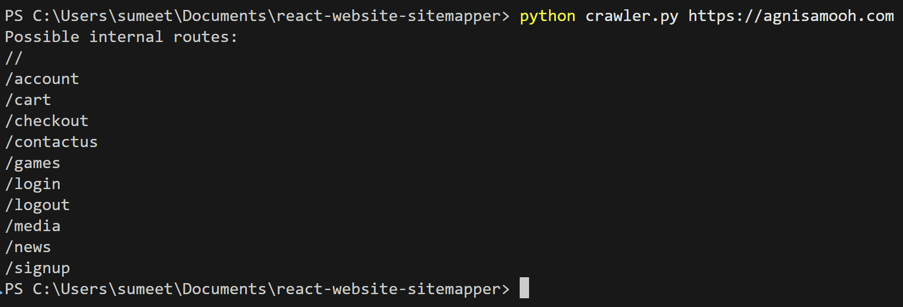

# React Website Sitemapper

Generic Javascript is simple to scrap, although with the React framework as JS is rendered on the client side it creates a problem
for traditional web scrappers. This Python script crawls a JavaScript-based React website to find all possible internal routes, including those that may be hidden or commented out in the source code.

## Considerations
The following are future considerations to edit this code to become more reliable as websites
can be coded to prevent web scrapping with many techniques.
- Data limiting requests - Find a method to by pass data limiting of requests.
- IP Bans - Find a method to bypass IP bans if you are banned from a website for too many requests.
- Captcha - Find a way to evade captcha e.g. from Cloudflare, possibly with the use of AI.
- Honeypot route IP Ban for rotating IP's - Find a way to understand legitimate web links (routes) to prevent scrapping an honey-pot weblink.

## Features

- Scans the homepage and all linked JavaScript bundles for route-like strings
- Outputs a formatted list of possible internal routes
- Handles both absolute and relative JS bundle URLs

## Requirements

- Python 3.x installed and added to your system PATH
- The following Python packages:
  - `requests`
  - `beautifulsoup4`

## Installation

Open your terminal or command prompt and run:

```bash
pip install requests beautifulsoup4
```

## Usage

To use this script, run the following command in your CLI, replacing `https://test.com` with the webpage you want to target. Note that the `http://` or `https://` prefix is required.

```bash
python crawler.py https://test.com
```


